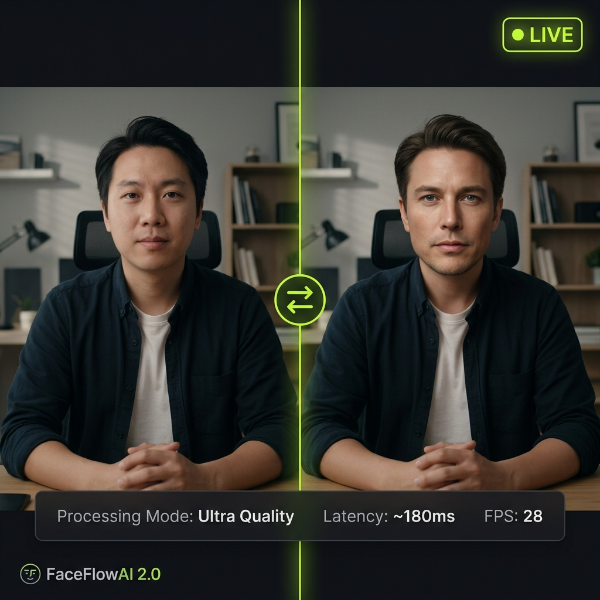
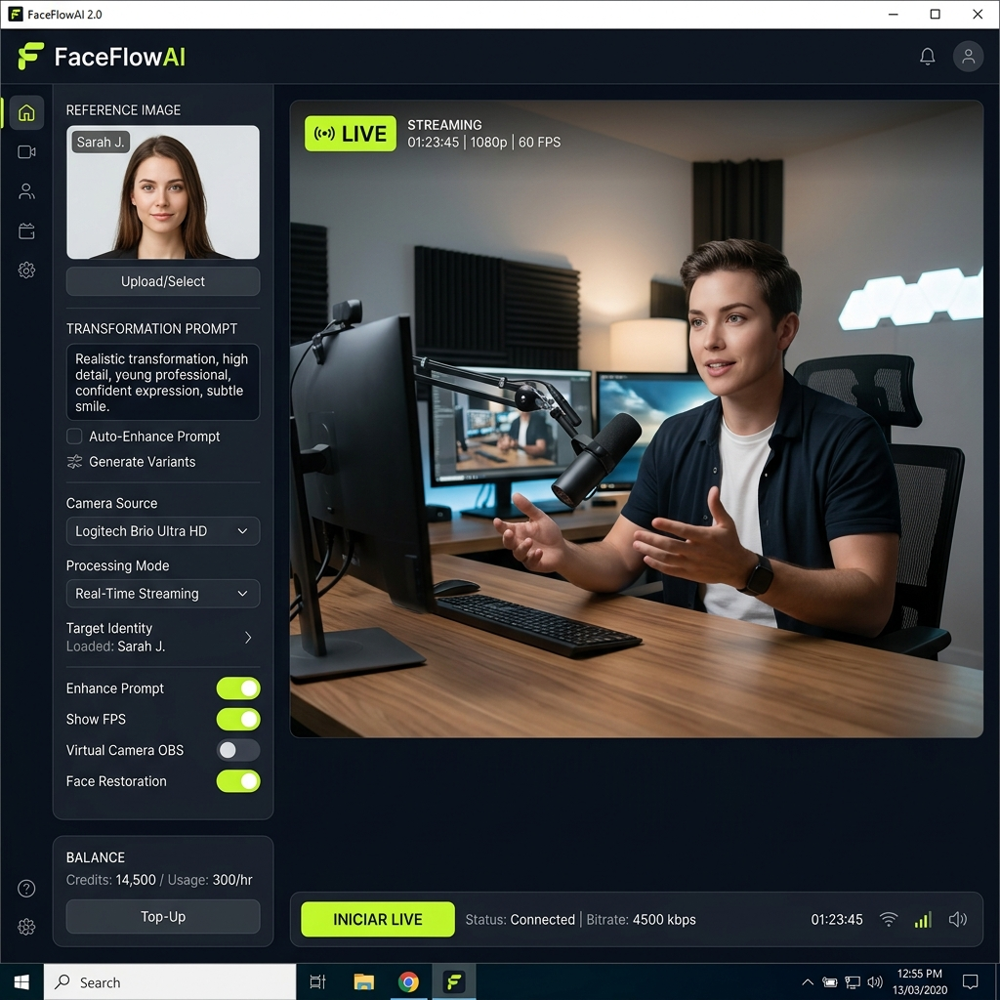
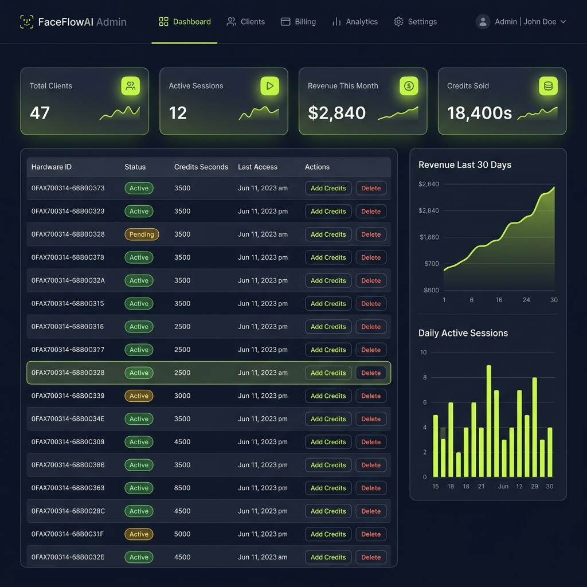

# ⚡ FaceFlowAI 2.0

**Real-time AI face swapping · Desktop client · Built for professionals**

 

 

> 🚀 **FaceFlowAI 2.0** es una aplicación de escritorio que transforma tu rostro en tiempo real con IA cinematográfica. Sin instalaciones complejas — descarga, extrae y ejecuta. Diseñado para streamers, creadores de contenido y usuarios profesionales.

 

&nbsp;

---

## 🎬 Demo en vivo

*Intercambio de rostro en tiempo real · ~180ms de latencia · 28 FPS*

---

## ✨ Características

<table>
<tr>
<td>

### 🎭 Face Swap en Tiempo Real
Transforma tu rostro con cualquier imagen de referencia al instante. El motor de IA procesa cada frame en la nube y devuelve el resultado con latencia mínima.

</td>
<td>

### 🖥️ Interfaz Profesional
Dark UI moderna con sidebar configurable, previsualización de cámara en vivo, selector de modo de procesamiento y control de sesión completo.

</td>
</tr>
<tr>
<td>

### 📡 Virtual Camera (OBS)
Salida directa a cámara virtual compatible con OBS Studio, Zoom, Teams y cualquier app que use dispositivos de captura.

</td>
<td>

### 💳 Sistema de Créditos
Balance integrado en la aplicación. Consulta tu saldo, últimas recargas y tiempo disponible sin salir de la app.

</td>
</tr>
<tr>
<td>

### 🔒 Activación por Hardware ID
Cada licencia está vinculada al hardware del usuario. Sin suscripciones — pagas por tiempo de uso real.

</td>
<td>

### ⚡ Prompt en Tiempo Real
Modifica el prompt de transformación sin desconectar la sesión. Los cambios se aplican al instante en el siguiente frame.

</td>
</tr>
</table>

---

## 📸 Capturas de Pantalla

### 🖥️ Aplicación Principal

### 📊 Panel Administrativo

---

## 🚀 Instalación

### Solo 3 pasos — sin Python, sin dependencias

| Paso | Acción |
|:---:|---|
| **1** | 📥 Descarga `FaceFlowAI.rar` desde [**Releases**](https://github.com/Monty-Gabriel/FaceFlow-AI-2.0/releases/latest) |
| **2** | 📂 Extrae el `.rar` en cualquier carpeta |
| **3** | ▶️ Ejecuta `FaceFlowAI.exe` |

> **⚠️ Nota:** Necesitas una **licencia activa** para usar la aplicación. Al primer inicio se registrará tu Hardware ID y quedará pendiente de activación. Contacta al administrador por Telegram para activarla.

---

## 🎛️ Uso

### 1. Iniciar la aplicación
Haz doble clic en **`FaceFlowAI.exe`** — no se necesita Python ni ninguna instalación adicional.

> Si Windows muestra un aviso de SmartScreen, haz clic en **"Más información" → "Ejecutar de todas formas"**.

### 2. Seleccionar imagen de referencia
Haz clic en el panel de **Imagen de referencia** y selecciona una foto clara del rostro objetivo.

### 3. Configurar la cámara
Elige tu cámara web del menú desplegable. La previsualización comienza automáticamente.

### 4. (Opcional) Personalizar el prompt
El prompt de transformación está preconfigurado para resultados óptimos. Puedes editarlo en tiempo real sin reconectar.

### 5. ¡Iniciar la sesión!
Haz clic en **▶ INICIAR LIVE**. La app se autenticará, iniciará la sesión y comenzará a transmitir frames transformados en tiempo real.

---

## 🔧 Modos de Procesamiento

| Modo | Descripción | Créditos/seg |
|---|---|---|
| **Fast** | Procesamiento rápido, menor calidad | ⬇ Menor |
| **Balanced** | Balance entre calidad y velocidad | ◼ Estándar |
| **Ultra Quality** | Máxima calidad, mayor latencia | ⬆ Mayor |

---

## 📡 Salida a Cámara Virtual (OBS)

1. Instala [OBS Studio](https://obsproject.com/)
2. Activa el toggle **"Salida Cámara Virtual (OBS)"** en la sidebar
3. En OBS, agrega una fuente → *Dispositivo de Captura de Video* → selecciona **OBS Virtual Camera**
4. El video generado por FaceFlowAI aparecerá automáticamente en OBS

> Compatible con Zoom, Teams, Meet, Twitch, YouTube Live y cualquier aplicación que use dispositivos de cámara.

---

## 🛠️ Tecnología

> La aplicación viene **precompilada** — no necesitas instalar Python ni ninguna dependencia.

| Componente | Uso |
|---|---|
| CustomTkinter | Interfaz gráfica moderna dark-mode |
| OpenCV | Captura de cámara en tiempo real |
| Motor de IA propietario | Streaming en tiempo real con la IA |
| Pillow + NumPy | Procesamiento de imágenes |

---

## 📋 Requisitos del Sistema

| | Mínimo | Recomendado |
|---|---|---|
| **OS** | Windows 10 | Windows 11 |
| **RAM** | 4 GB | 8 GB+ |
| **Cámara** | 720p | 1080p |
| **Conexión** | 5 Mbps | 20 Mbps+ |

---

## 🤝 Soporte y Compra

¿Necesitas una licencia, tienes preguntas o quieres reportar un bug?

**[@g\_g\_master\_g0st](https://t.me/g_g_master_g0st)**

---

## ⚠️ Aviso Legal

Este software requiere una **licencia activa** vinculada a tu hardware. El uso sin licencia no está permitido.

El intercambio de rostros debe usarse **únicamente con fines legales y con el consentimiento de las personas involucradas**. El usuario es el único responsable del uso que haga de esta herramienta.

---

Made with ⚡ by **FaceFlowAI Team**

